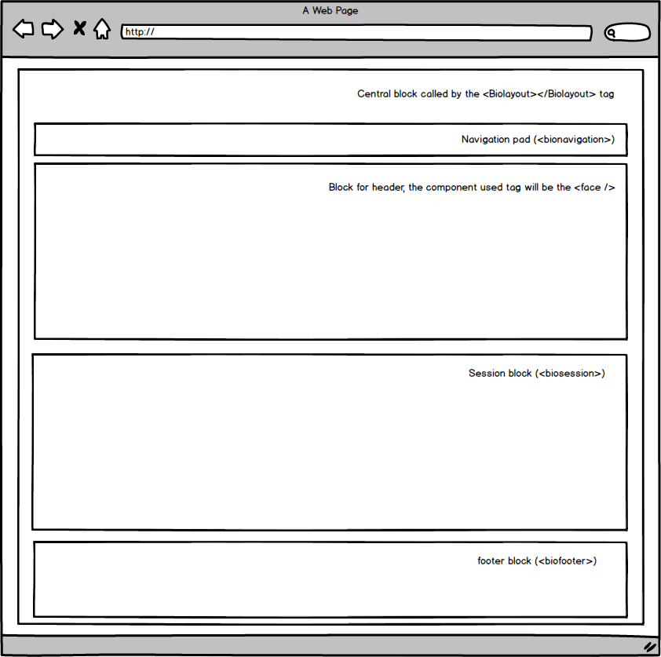

# BioComponents-React

Bio components is a methodology that aims to use the basis of Biology to shape layouts in a healthy way.
## Check below some of our tags already drafted for the project.

<biolayout></biolayout>
<bionavigation>
<face>
<biosession>
<biofooter>

